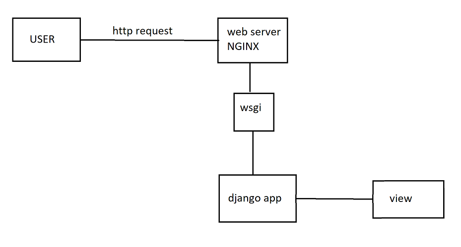

# Настройка окружения проекта и общие сведения

Для начала нам нужно определиться какие фреймворки и какие
библиотеки будут использоваться в рамках данного проекта.
Это нужно для того, чтобы заранее было ясно какие зависимости
есть в проекте, иначе будут конфликты версий. Также влияет роль
какую версию интерпретатора мы будем использовать. Чтобы решить данную
проблему я взял в качестве пакетного менеджера <b>poetry</b> https://python-poetry.org/

Выполняем команды

```shell
poetry init
poetry add <package>
```

python = "^3.10"
<br>
django = "4.2.1"
<br>
pytest = "^8.2.2"
<br>
flake8 = "^7.0.0"

### Описание конфига poetry

```yaml
[ tool.poetry ]
  name = "employee-monitoring"
  version = "0.1.0"
  description = ""
  authors = ["psychx <#_#>"]
  readme = "README.md"

  [ tool.poetry.dependencies ]
  python = "^3.10"


  [ build-system ]
  requires = ["poetry-core"]
  build-backend = "poetry.core.masonry.api"
```

tool.poetry.dependencies - зависимости, которые используются при запуске проекта.
Есть также tool.poetry.group.dev.dependencies зависимости использующиеся при разработке.

# Почему для реализации взят Django?

- Удобный инструмент в рамках языка Python особенно если используется монолитная архитектура

# Взаимодействие пользователя с сайтом



- Пользователь делает запрос
- Запрос доходит до веб-сервера который слушает порты (например 80)
- Взаимодействие с django через wsgi интерфейс
- Отрабатывают django представления отвечающие за запрос (view)
- Возвращается HTML страница

django содержит отладочный сервер который запускается командой

```shell
manage.py runserver
```

# Модель MTV в django


views - Представление, которое может быть классом или функцией.
если ничего не найдено, то генерируется ошибка 404
templates - frontend
model - данные используемые в шаблоне представления (views)

# Как работает Employee monitoring?
Каждый сотрудник кафе имеет за собой N количество бронированных столов от клиентов
за которыми он закреплен. Изначально есть X бронированных столов которые распределяются
по сотрудникам кафе. Также есть форма, где клиент может забронировать свободный стол
Далее система закрепит его за сотрудником.

В чем заключается мониторинг?
<br>
Менеджер видит каждый бронированный стол на определенное время за которым закреплен сотрудник
также он видит весь пул заказов которые запросил клиент. От каждого обработанного заказа береться процент от суммы и идет в зарплату сотруднику.

Исходя из этой логики будет создано несколько приложений.

- reservation
- employee
- manager

Для создания приложений будет выполнена команда

```shell
python manage.py startapp <app>
```

Каждое приложение реализуется в виде отдельного пакета.
внутри которого есть
- пакет migrations который нужен для миграций в БД
- admin.py - настройка админ панели
- apps.py конфигурирование текущего приложения
- models.py хранение ORM моделей для взаимодействия с БД
- tests.py модуль с тестирующими процедурами
- views.py хранение представлений текущего приложения

### Регистрация приложений

Заходим в employee_monitoring/settings.py и добавляем в коллекцию INSTALLED_APPS наши приложения

```python
INSTALLED_APPS = [
    'django.contrib.admin',
    'django.contrib.auth',
    'django.contrib.contenttypes',
    'django.contrib.sessions',
    'django.contrib.messages',
    'django.contrib.staticfiles',
    'employee.apps.EmployeeConfig',
    'reservation.apps.ReservationConfig',
    'manager.apps.ManagerConfig',
]
```

### Настройка безопасности приложений

- Здесь будет про настройку безопасноти. Пока что все в дебаге, поэтому особо не настраивал


# Описание приложений


